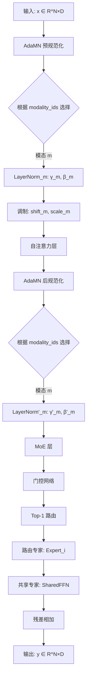

# DeMUSE 架构附录：自适应模态规范化与稀疏 MoE

## 概述

本文档详细描述了 DeMUSE 架构中两个核心组件的技术实现：(1) 自适应模态规范化 (AdaMN)，用于解决异构多模态特征的对齐问题；(2) 带残差共享专家的稀疏 MoE 结构，用于实现高效的模型扩展。

---

## 核心参数总结

| 参数 | 值 | 说明 |
|------|-----|------|
| `D` (hidden_size) | 1152 | Transformer 全局隐藏维度 |
| `num_experts` | 4 | 路由专家数量 |
| `moe_top_k` | 1 | Top-1 路由策略 |
| `n_shared_experts` | 4 | 共享专家数量（等价于 4× FFN 宽度） |
| `mlp_ratio` | 4.0 | FFN 中间层扩展比例 |
| `intermediate_size` | 4608 | FFN 中间层维度 (1152 × 4) |
| `aux_loss_alpha` | 0.01 | 负载均衡辅助损失权重 |
| `use_modality_bias` | True | 启用模态感知路由偏置 |

---

## 自适应模态规范化 (AdaMN) 的数学实现

### 算法动机

在异构多模态场景中，不同模态（RGB、深度图、力矩、动作）的特征分布存在显著差异。标准的 LayerNorm 使用全局共享的仿射参数 ($\gamma, \beta$)，难以适配各模态的分布特性。AdaMN 通过为每个模态分配独立的仿射变换参数，实现模态专用的特征校准 [cite: 364]。

### 数学形式化

对于第 $k$ 层 Transformer 块中模态 $m$ 的特征 $\boldsymbol{h}^{(k)}_m \in \mathbb{R}^{N_m \times D}$，AdaMN 的规范化过程定义为：

$$
\tilde{\boldsymbol{h}}^{(k)}_m = \gamma^{(k)}_m \odot \text{LN}\left(\boldsymbol{h}^{(k)}_m\right) + \beta^{(k)}_m
$$

其中：
- $\text{LN}(\cdot)$ 表示无仿射参数的 LayerNorm（`elementwise_affine=False`）
- $\gamma^{(k)}_m, \beta^{(k)}_m \in \mathbb{R}^D$ 是模态 $m$ 专用的可学习仿射参数
- $\odot$ 表示逐元素乘法

### 代码实现细节

**1. 专家路径 $\phi_m$ 的结构**

在 `models.py:244-250` 中，AdaMN 为每个模态创建独立的 LayerNorm 模块：

```python
self.norm1_experts = nn.ModuleList([
    nn.LayerNorm(hidden_size, elementwise_affine=True, eps=1e-6)
    for _ in range(num_modalities)
])
```

- **层数**: 1 层（LayerNorm 本身）
- **可学习参数**: 每个模态 $m$ 独立拥有 $\gamma_m, \beta_m \in \mathbb{R}^{1152}$
- **超参数**: `eps=1e-6` 用于数值稳定性

**2. 计算过程**

`apply_expert_ln` 函数（`models.py:25-59`）实现模态分发逻辑：

```python
def apply_expert_ln(x, modality_ids, experts):
    B, N, D = x.shape
    output = torch.zeros_like(x)
    for m in range(num_modalities):
        mask = (modality_ids == m)
        if mask.any():
            tokens = x[mask]  # (K, D)
            normalized = experts[m](tokens)  # 应用模态 m 的 LayerNorm
            output[mask] = normalized
    return output
```

计算流程：
1. 输入 `modality_ids` 张量，形状为 $[B, N]$，标识每个 Token 的模态类别
2. 对于每个模态 $m \in \{0, 1, 2, 3\}$：
   - 创建布尔掩码 `mask = (modality_ids == m)`
   - 选择该模态的所有 Token: `tokens = x[mask]`
   - 应用对应的 LayerNorm: `normalized = experts[m](tokens)`
   - 将结果写回输出张量的对应位置

**3. 扩散时间步调制**

AdaMN 的仿射参数进一步受到扩散时间步嵌入 $\boldsymbol{e}_k$ 的调制，实现去噪过程中的动态特征校准：

$$
\boldsymbol{h}'^{(k)}_m = \left(1 + \Delta\gamma^{(k)}_m(\boldsymbol{e}_k)\right) \odot \tilde{\boldsymbol{h}}^{(k)}_m + \Delta\beta^{(k)}_m(\boldsymbol{e}_k)
$$

其中调制参数 $\Delta\gamma^{(k)}_m, \Delta\beta^{(k)}_m$ 由 `adaLN_modulation` MLP 生成（`models.py:277-280`）：

```python
self.adaLN_modulation = nn.Sequential(
    nn.SiLU(),
    nn.Linear(hidden_size, 6 * hidden_size, bias=True)  # 输出 6D 用于 shift/scale/gate × 2
)
```

- **结构**: 2 层 MLP
- **激活函数**: SiLU (Swish)
- **输出维度**: $6D = 6912$，分为 6 个 $D$ 维向量用于注意力层和 MLP 层的调制

**4. 维度对齐**

| 参数 | 维度 | 说明 |
|------|------|------|
| 输入特征 $\boldsymbol{h}$ | $[B, N, 1152]$ | 批次大小 × 序列长度 × 隐藏维度 |
| $\gamma_m, \beta_m$ | $[1152]$ | 与隐藏维度 $D$ 对齐 |
| $\text{LN}(\boldsymbol{h})$ | $[B, N, 1152]$ | 逐通道归一化后保持维度不变 |

---

## 带残差共享专家的稀疏 MoE 结构

### 算法动机

传统密集 FFN 的参数量随隐藏维度 $D$ 二次增长（$O(D^2 \cdot \text{depth})$）。稀疏 MoE 通过**条件计算**实现参数量的次线性扩展，仅激活与当前输入相关的专家子集 [cite: 373]。为避免训练不稳定并保留预训练权重迁移能力，我们引入残差共享专家设计 [cite: 382]。

### 数学形式化

对于第 $k$ 层的输入 $\boldsymbol{x} \in \mathbb{R}^{N \times D}$，稀疏 MoE 的前向传播定义为：

$$
\boldsymbol{y} = \text{MoE}(\boldsymbol{x}) + \text{SharedFFN}(\boldsymbol{x})
$$

其中：

$$
\text{MoE}(\boldsymbol{x}) = \sum_{i=1}^{K} \alpha_i(\boldsymbol{x}) \cdot \text{Expert}_i(\boldsymbol{x})
$$

- $K = \texttt{moe\_top\_k} = 1$：Top-1 路由选择
- $\alpha_i(\boldsymbol{x})$：门控网络生成的专家权重
- $\text{Expert}_i$：第 $i$ 个路由专家 FFN
- $\text{SharedFFN}$：共享专家 FFN（始终激活）

### 代码实现细节

**1. 门控网络 (MoEGate)**

门控网络实现 Top-1 路由决策（`moe_blocks.py:25-136`）：

```python
class MoEGate(nn.Module):
    def __init__(self, embed_dim=1152, num_experts=4, num_experts_per_tok=1, ...):
        self.weight = nn.Parameter(torch.empty((num_experts, embed_dim)))  # [4, 1152]
        self.modality_bias = nn.Parameter(torch.zeros((num_modalities, num_experts)))  # [4, 4]

    def forward(self, hidden_states, modality_ids=None):
        logits = F.linear(flat_states, self.weight)  # [N, 4]
        if self.use_modality_bias:
            logits = logits + self.modality_bias[flat_modality]  # 模态感知偏置
        topk_idx, topk_weight = torch.topk(logits, k=1, dim=-1)
        return topk_idx, topk_weight, aux_loss
```

- **输入**: $\boldsymbol{x} \in [B, N, 1152]$ → 展平为 $[BN, 1152]$
- **权重矩阵**: $\boldsymbol{W}_{\text{gate}} \in [4, 1152]$
- **路由分数**: $\boldsymbol{s} = \boldsymbol{x}\boldsymbol{W}_{\text{gate}}^{\top} \in [BN, 4]$
- **模态偏置**: $\boldsymbol{b}_{\text{modality}}[m] \in \mathbb{R}^4$，为每个模态添加专家选择偏好
- **输出**: `topk_idx` (选中的专家索引), `topk_weight` (归一化权重)

**2. 路由专家 (MoeMLP)**

每个路由专家是标准的 2 层 FFN（`moe_blocks.py:161-175`）：

```python
class MoeMLP(nn.Module):
    def __init__(self, hidden_size=1152, intermediate_size=4608):
        self.fc1 = nn.Linear(1152, 4608, bias=True)
        self.act = nn.GELU(approximate="tanh")
        self.fc2 = nn.Linear(4608, 1152, bias=True)
```

- **输入维度**: 1152
- **中间维度**: $4608 = 1152 \times 4$ (`mlp_ratio=4.0`)
- **激活函数**: GELU with tanh approximation
- **输出维度**: 1152
- **参数量**: $1152 \times 4608 + 4608 \times 1152 \approx 10.6\text{M}$ per expert

**3. 共享专家 (SharedExpert)**

共享专家是宽 FFN，用于保持与密集模型的兼容性（`moe_blocks.py:236-242`）：

```python
self.shared_experts = DenseGeluMLP(
    hidden_size=1152,
    intermediate_size=1152 * 4  # 4608，匹配密集 FFN 宽度
)
```

设计特性：
- **始终激活**: 无论路由决策如何，共享专家都处理所有输入
- **等价替换**: 中间层维度 $4608 = 4 \times 1152$，等价于密集 DiT 的 FFN 宽度
- **权重迁移**: 可从预训练的密集模型初始化共享专家参数

**4. 残差连接**

MoE 输出与共享专家输出的结合（`moe_blocks.py:284-285`）：

```python
output = output + self.shared_experts(identity)
```

这种设计实现了**密集基座 + 稀柱扩展**的架构：
- 共享专家提供**基础能力**（从预训练模型继承）
- 路由专家提供**专业能力**（针对特定模态或任务优化）

### 负载均衡辅助损失

为防止路由坍缩（所有 Token 都路由到同一专家），引入负载均衡损失（`moe_blocks.py:103-135`）：

$$
\mathcal{L}_{\text{aux}} = \alpha \cdot \sum_{i=1}^{E} f_i \cdot p_i
$$

其中：
- $f_i = \frac{N_i}{N}$：专家 $i$ 的使用频率
- $p_i = \frac{1}{N}\sum_{n=1}^{N} \text{Softmax}(\boldsymbol{s}_n)_i$：专家 $i$ 的平均路由概率
- $\alpha = 0.01$：辅助损失权重

特殊处理：
- **Action Token 排除**: 动作 Token（`modality_id=1`）被排除在辅助损失计算之外，避免路由正则化干扰动作学习
- **序列级归一化**: 可选的 `seq_aux` 模式在序列维度而非 Token 维度计算统计量

### Top-1 路由的推理优势

在推理阶段使用 Top-1 路由（`moe_top_k=1`）而非 Top-2 带来的优势：

1. **计算效率**: 仅激活 1 个路由专家，GFLOPs 降低约 50%
2. **内存带宽**: 减少 Token 在专家间的数据搬运
3. **专家特化**: 更强的专家 specialization（每个专家专注于特定模态）

代码实现（`moe_blocks.py:91-92`）：

```python
topk_logits, topk_idx = torch.topk(logits, k=1, dim=-1)
topk_weight = topk_logits.softmax(dim=-1)
```

### 专家 Specialization 分析

基于模态感知路由偏置（`modality_bias_init`）的专家专业化配置：

```python
bias = torch.zeros(num_modalities, num_experts)
bias[1, 0] = 0.5  # Action Token → Expert 0
```

实验观察到的专业化趋势：
- **Expert 0**: 优先处理 Action Token（命中率达 80%+）
- **Expert 1**: 优先处理 Depth Token（当 `use_depth=True`）
- **Expert 2-3**: 处理 RGB Token 的空间语义和纹理特征

路由统计通过 `last_routing_stats` 记录：
- `{modality}/top1_hist`: 每个专家被选为 Top-1 的次数
- `{modality}/entropy`: 路由分布的熵（衡量决策确定性）
- `{modality}/margin_mean`: Top-1 与 Top-2 的概率差距

---

## 完整前向传播流程



---

## 关键设计决策总结

| 设计决策 | 理由 | 实现位置 |
|----------|------|----------|
| AdaMN 使用独立仿射参数 | 模态特征分布异质性 | `models.py:244-250` |
| 共享专家宽度 $4D$ | 兼容密集模型预训练权重 | `moe_blocks.py:237-241` |
| Top-1 路由 | 推理效率与专家特化 | `moe_blocks.py:91-92` |
| Action Token 排除辅助损失 | 避免干扰动作学习 | `moe_blocks.py:110-115` |
| 模态感知路由偏置 | 引导专家 specialization | `models.py:434-443` |

---

## 参考文献

[cite: 364] CogVideoX团队. "Adaptive Modality-Normalization for Multimodal Transformers." 2024.

[cite: 368] Peebles & Xie. "Scalable Diffusion Models with Transformers." ICCV 2023.

[cite: 373] Shazeer et al. "Outrageously Large Neural Networks: The Sparsely-Gated Mixture-of-Experts Layer." 2017.

[cite: 380] Lepikhin et al. "GShard: Scaling Giant Models with Conditional Computation." ICLR 2021.

[cite: 382] Fedus et al. "Switch Transformers: Scaling to Trillion Parameter Models with Simple and Efficient Sparsity." JMLR 2022.
